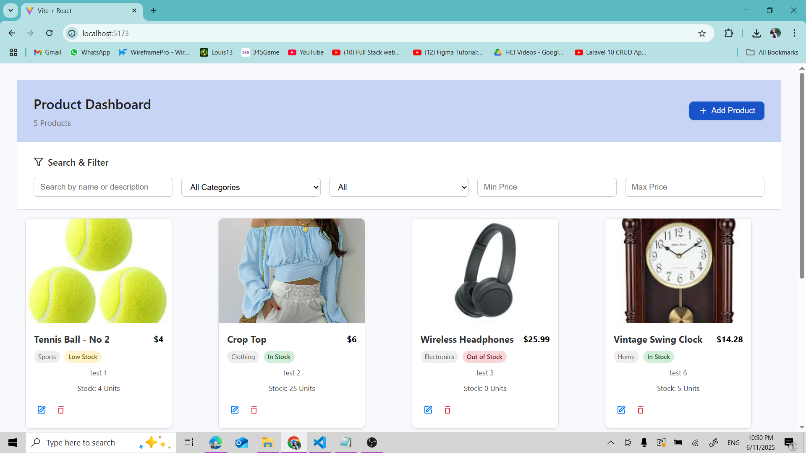
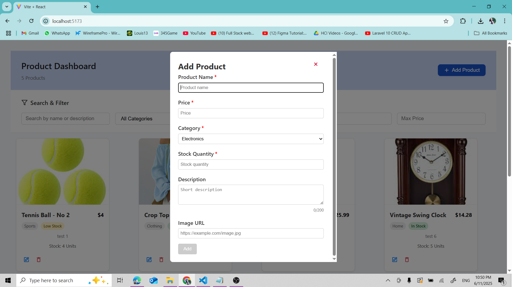
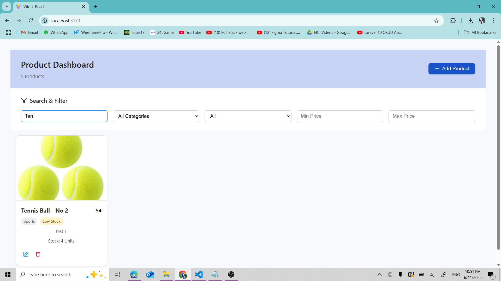
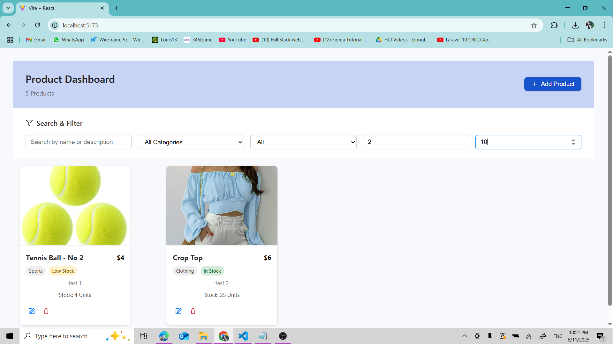
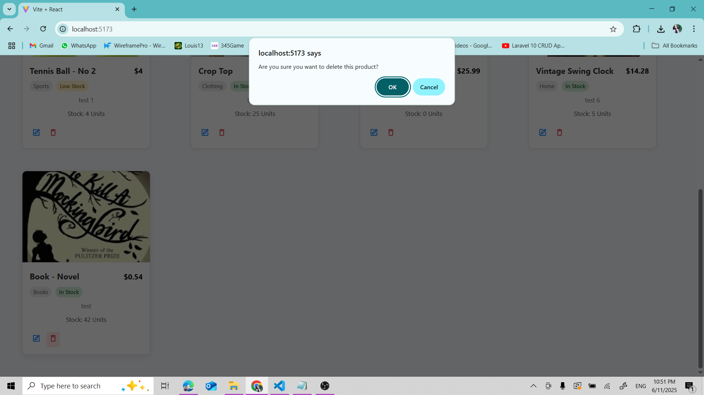
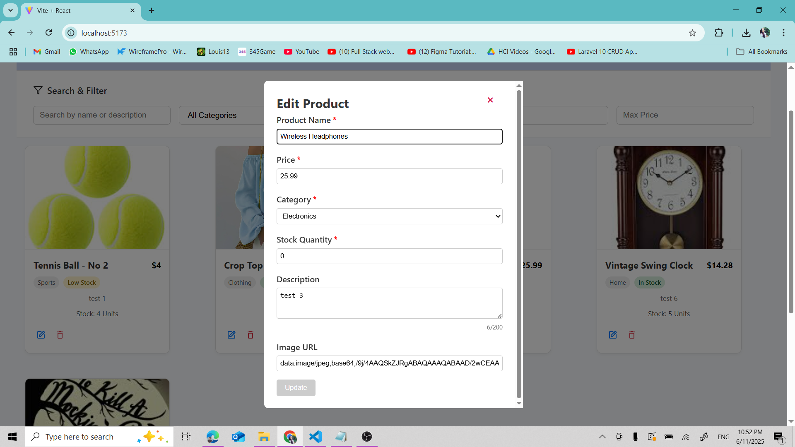

# 🛍️ React E-Commerce Product Dashboard

This is a fully functional E-Commerce Product Dashboard built with **React**, designed for managing a product inventory. It allows users to **Add**, **Edit**, **Delete**, **Search**, **Filter**, and **Undo** product actions, with data persistence using local storage.

---

## 🚀 Features

- ✅ Add new products with validation
- ✅ Edit existing products
- ✅ Delete single products (with confirmation)
- ✅ Undo deletion within 5 seconds
- ✅ Filter by category, price range, and stock
- ✅ Real-time search by product name
- ✅ Fully persistent state via localStorage
- ✅ Responsive, accessible UI
- ✅ Comprehensive test coverage with Vitest & React Testing Library

---

## 🧱 Tech Stack

- React
- Vite
- React Final Form
- React Testing Library
- Vitest
- Tailwind CSS

---

## 📦 Installation

1. Clone the repository:

https://github.com/your-username/ecommerce-dashboard.git

2. Install dependencies:

npm install

3. Run the development server:

npm run dev

4. For SCSS support

npm install sass

5. React icons

npm install react-icons

6. Install react final form

npm install react-final-form

Then open http://localhost:5173 in your browser.

---

## 🧪 Running Tests

To run unit and component tests:

npm run test

This runs all test cases using **Vitest** and **React Testing Library**.

---

## 🗃️ Folder Structure

src/
-> components/    # Reusable UI components (modals, product cards, etc.)

-> context/       # Global ProductContext with reducer

-> hooks/         # Custom hooks (useProducts, useFilters, etc.)

-> pages/         # Page layout or main dashboard

-> utils/         # Utilities and validation logic

-> App.jsx        # Main app component

-> main.jsx       # Entry point

---

## ⚙️ Available Scripts

| Command         | Description                      |
| --------------- | -------------------------------- |
| npm run dev     | Start development server         |
| npm run build   | Build for production             |
| npm run preview | Preview production build locally |
| npm run test    | Run tests with Vitest            |

---

## 📋 Functional Requirements (Assessment Scope)

- [x] Add product via modal form
- [x] Form validation (required fields, positive numbers)
- [x] Product list displays all products
- [x] Filter and search products
- [x] Edit product with pre-filled modal
- [x] Delete product with undo support
- [x] Bulk delete selected products
- [x] Persist products in localStorage
- [x] Fully tested key components

---

## ✅ Testing Highlights

- AddProductModal: form validation, successful submission, edit mode
- ProductList: empty state, display accuracy, image error handling
- useProducts: reducer logic for add/edit/delete/undo
- FilterComponent: filters and search behavior

---

## 📸 Screenshots

### 🧩 Full Dashboard View

### ➕ Add Product Modal

### 🔍 Filters & Search

### 📱 Mobile Optimization

### ❌ Delete Confirmation

### ✏️ Edit Product

---

## Demo Video

https://drive.google.com/file/d/1HWK2QA_EdtIJOnbSL9VbZPkRl85Zhveg/view?usp=sharing

